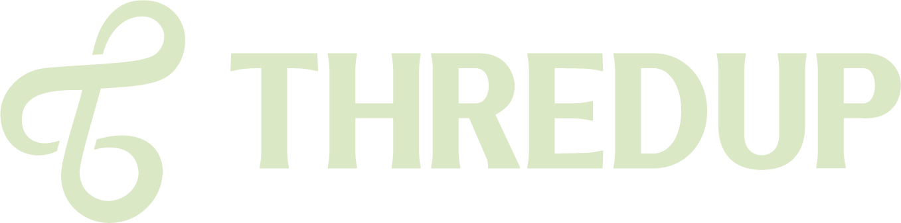

 

# Hi, I'm Joe Waugh

**Sr. Machine Learning Engineer at [ThredUp](https://www.thredup.com)** 

I build ML systems at scale — computer vision, NLP/LLMs, and the infrastructure that ties it all together. I care about shipping models that actually work in production.

---

### What I work on

- **Computer Vision** — image classification, visual search, product understanding
- **NLP / LLMs** — text processing, language models, generative AI applications
- **MLOps** — model serving, pipelines, monitoring, and everything in between

---

### Tech Stack

**Languages**

**ML / Deep Learning**

**Data**

**Infrastructure**

---

### Contribution Snake

<picture>
  <source media="(prefers-color-scheme: dark)" srcset="https://raw.githubusercontent.com/joewaugh-thredup/joewaugh-thredup/output/github-snake-dark.svg" />
  <source media="(prefers-color-scheme: light)" srcset="https://raw.githubusercontent.com/joewaugh-thredup/joewaugh-thredup/output/github-snake.svg" />
  
</picture>

---

> *Random dev wisdom:*

---

### Connect

